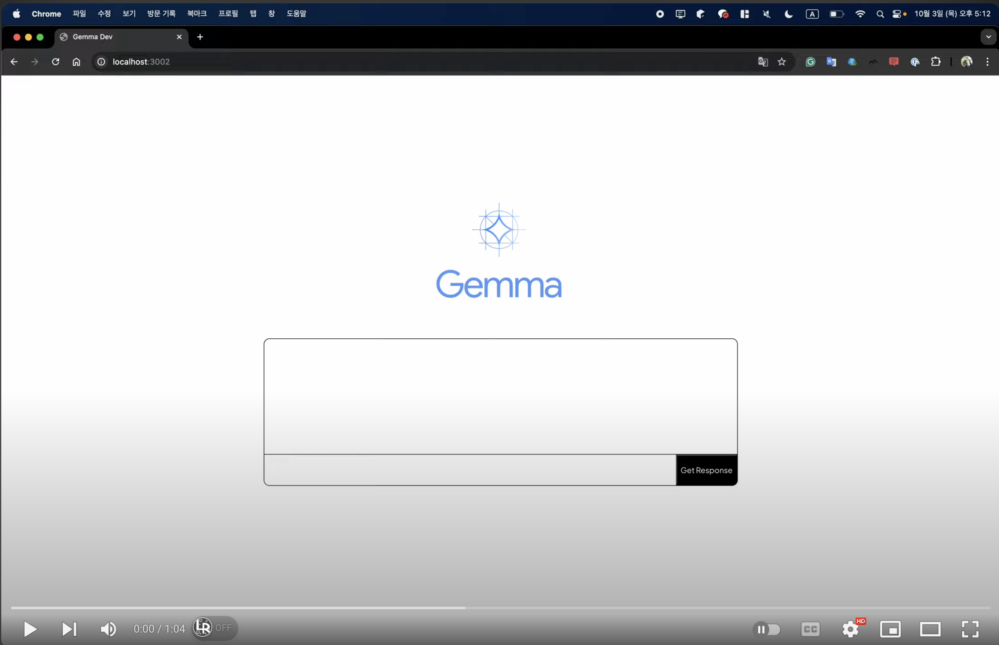

<p align="center"></p>
<h1>Gemma App</h1>

## Installation

Install Javascript dependencies.

```bash
yarn
```

`gemma-1.1-2b-it-gpu-int4.bin` model file can be shown in the `public/` directory.
(That model file has been added as Git LFS)

Therefore, your file structure in `public/` should be looks like as the belows:

```plaintext
tree -L 2 public/

# OUTUT:
# public
# ├── gemma-1.1-2b-it-gpu-int4.bin
# ├── index.html
# ├── manifest.json
# └── robots.txt
```

## How to start

```bash
yarn start
```

## Demo Video

[](https://www.youtube.com/watch?v=oDo6zc6_-3w)
